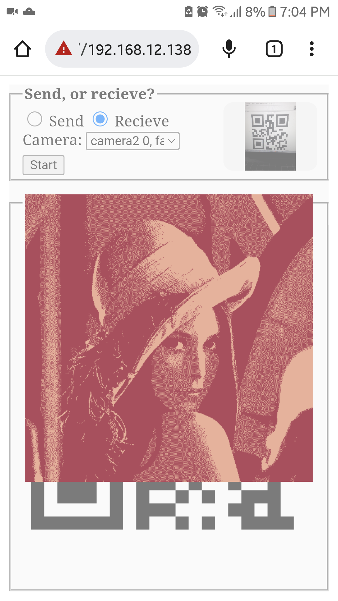

# Shake

>  This repo is a POC/Prototype of sending and recieveing data using QR barcodes.

    For now, this prototype will send/recieve one fixed [Lenna](https://en.wikipedia.org/wiki/Lenna) image. In `lenna.js` file the image has been converted to array buffer, later in the code, it'll compressed before starting the sending operation.

    We've two main operations; send the image, or recieve it, we can choose the camera input from the select element, and then click `Start` button.

    For `Send` operation, the project will wait to read the `Ready` QR code, which will be generated by the receiver, after that, the sender will generate the first chunk of the QRs, and keep going by getting feedback from the receiver; which is the index of the next QR.

## Run local server with SSL

    The easiest way to do this is by using **AppServ**, in particular the version **v8.5.0**; this version provides a free SSL to use, it's available [here](https://www.appserv.org/en/version-history/#:~:text=x%20%E2%80%93%202.5.x.-,AppServ%20v%208.5.0,-Release%20Date%20%3A).

    After installing this version, search for `Enable SSL` to enable SSL.

